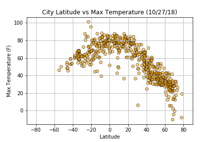

# API_Homework

<h1> Data Analysis of Random Sampling of Cities in relation to their distance from the equator</h1>

<h3> Expecated results:</h3>

As most would expect due to their education of geography, we believe that most cities will tend to be more tropical (hotter and more humid) as they distance is reduced from the equater. This analysis is being complete late October, and should provide some large variations between cities and their relation to the equator, due to the season.

<h3>Temperature</h3>

As we can see from the provide graph below, there is a significant trend of cities closer to the equator (Latitude of 0) reporting higher maximum temperatures. What one may not expect is that the northern hemisphere (Latitude greater than 0) is reporting much lower maximum temperatures.

<h3>Humidity</h3>

From the data that was analyzed and plotted, we can see that the direct correlation between humidity levels, and the latitude of the city.  There looks to be a bit of clustering near the equator, but also around 40&deg;-75&deg;. This neither proves, nor disproves indefinitely that humidity is directly correlated with distance from the equator.

<h3>Miscellaneous</h3>

Based on the data available, Cloudiness, is completely irrespective of distance from the equator. My assumptions are that this is entirely based on local weather patterns and not distance from the equator.  There is no significant relation between Cloudiness and wind speed either.  An interesting note, though: there seems to be a potential relationship between windspeed and temperature, mainly affecting the northern hemisphere.

<h3>Conclusion</h3>

In closing, I feel that the main hypothesis of temperature being higher, the closer a city is located to the equator was proven in the datasets. However, it seems that humidity, wind speed, and cloudiness are unrelated to the lattitude position.  An intersting find, that could be explored in the future, is the similarities to windspeed and colder temperatures. A copy of the scatter charts have been provided below to highlight this find.

 